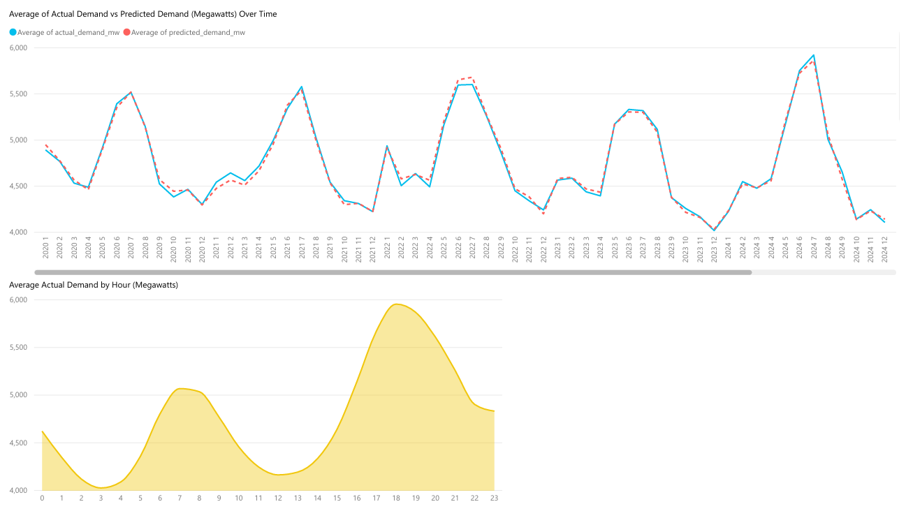
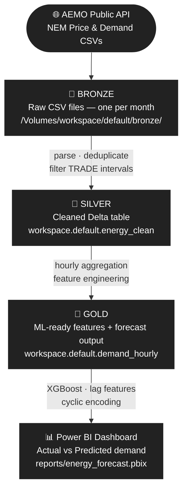

# Energy Demand Forecasting (Victoria, Australia)


An end-to-end energy demand forecasting pipeline that ingests 5-minute interval data from the **Australian Energy Market Operator (AEMO)** public dataset, processes it through a **medallion architecture** on Databricks, and produces hourly demand forecasts for the Victoria (VIC1) region using **XGBoost** which is then visualised in Power BI.

## Dashboard



## Architecture



---

## Results

<!-- TODO: Run 4_forecasting.ipynb and fill in the metrics printed to the cell output -->
<!-- Example of what a filled-in row looks like:  MAE | 182.4 MW -->

| Metric | Value |
|--------|-------|
| Forecast target | Hourly average demand (MW) — VIC1 |
| Training period | 2020 – 2023 |
| Test period | 2024 (full year holdout, ~8,760 hours) |
| MAE | 353.54 mw |
| RMSE | 495.51 mw |
| MAPE | 8.09% |

---

## Tech Stack

| Layer | Technology |
|-------|-----------|
| Platform | Databricks |
| Processing | PySpark |
| ML | XGBoost, scikit-learn |
| Visualisation | Power BI |
| Data source | [AEMO NEM Price and Demand](https://www.aemo.com.au/energy-systems/electricity/national-electricity-market-nem/data-nem/aggregated-data) |

---

## Notebooks

Run in order:

| # | Notebook | Description |
|---|----------|-------------|
| 0 | `0_config.ipynb` | Creates Bronze / Silver / Gold Unity Catalog volumes |
| 1 | `1_bronze_ingest.ipynb` | Downloads monthly AEMO CSVs (2020 → present) into Bronze volume |
| 2 | `2_silver_transform.ipynb` | Cleans, deduplicates, and upserts to Silver Delta table |
| 3 | `3_gold_aggregate.ipynb` | Aggregates to hourly buckets and engineers time features |
| 4 | `4_forecasting.ipynb` | Trains XGBoost model and writes predictions to Gold forecast table |
| 5 | `5_export_pbi.dbquery.ipynb` | Exports forecast table for Power BI consumption |

---

## Setup

### Prerequisites

- Databricks workspace with Unity Catalog enabled
- Cluster running **Databricks Runtime 14+** (Python 3.10+)
- `xgboost` installed on the cluster (or run `%pip install xgboost` in notebook 4)

---

## Feature Engineering

The XGBoost model uses the following features:

| Feature | Description |
|---------|-------------|
| `hour_sin`, `hour_cos` | Cyclic encoding of hour-of-day |
| `month_sin`, `month_cos` | Cyclic encoding of month |
| `dow_sin`, `dow_cos` | Cyclic encoding of day-of-week |
| `lag_day` | Demand 24 hours prior |
| `lag_week` | Demand 168 hours (1 week) prior |
| `rolling_week_avg` | 7-day rolling average demand |
| `is_weekend` | Binary weekend indicator |

---

## Data Source

Data is sourced from AEMO's public NEM aggregated data files:

```
https://www.aemo.com.au/aemo/data/nem/priceanddemand/PRICE_AND_DEMAND_{YEAR}{MONTH}_{REGION}.csv
```

- **Region:** VIC1 (Victoria)
- **Interval:** 5 minutes
- **Filter:** `PERIODTYPE = 'TRADE'` intervals only

No API key or authentication required. Data is freely available under AEMO's public data licence.

---

## Project Structure

```
energy-forecasting/
├── 0_config.ipynb               # volume setup and constants
├── 1_bronze_ingest.ipynb        # data ingestion
├── 2_silver_transform.ipynb     # cleaning
├── 3_gold_aggregate.ipynb       # feature engineering
├── 4_forecasting.ipynb          # XGBoost forecasting model
├── 5_export_pbi.dbquery.ipynb   # Power BI export SQL
├── reports/
│   ├── energy_forecast.pbix     # Power BI report
│   ├── dashboard_preview.png    # screenshot
│   └── energy_forecast.pdf      # PDF version
└── README.md
```
